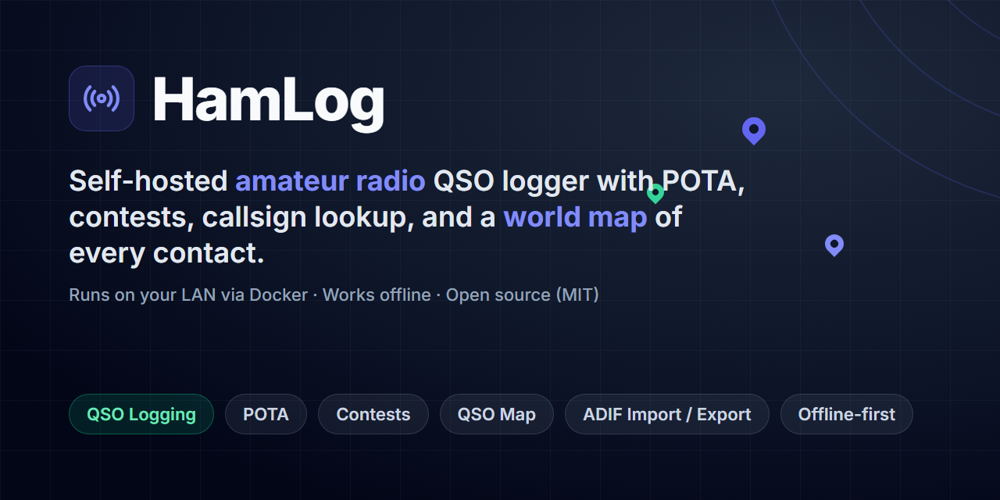
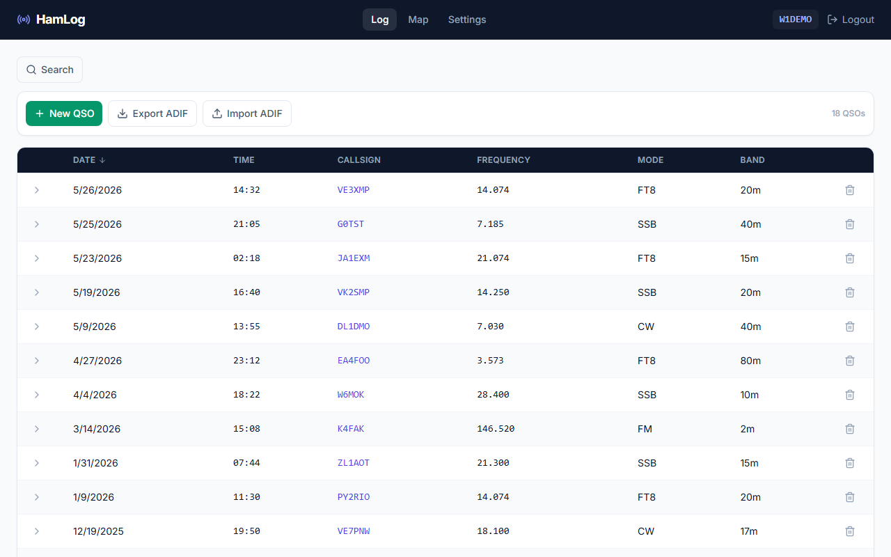
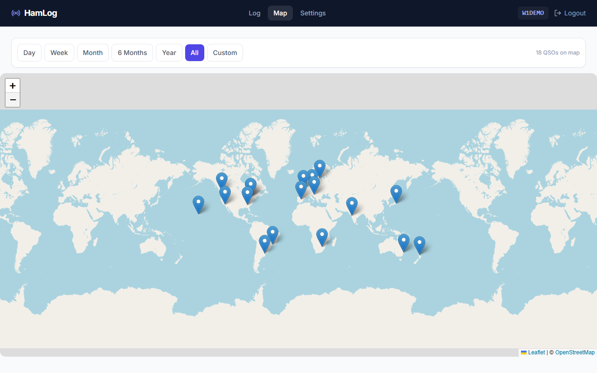
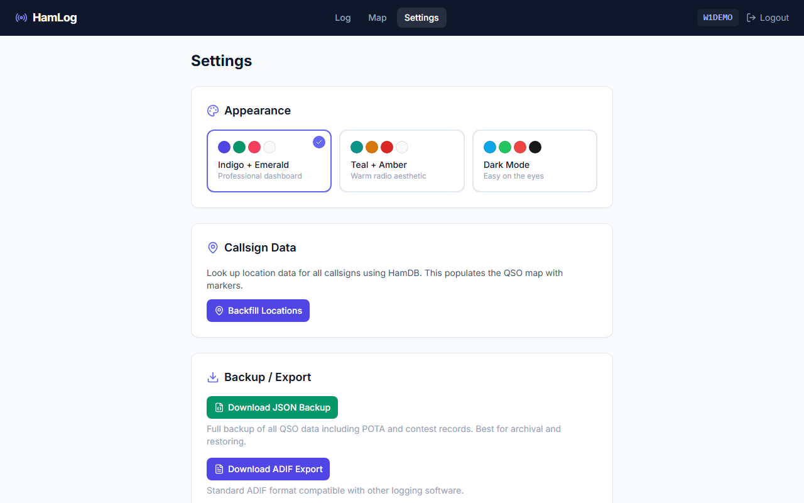

<p align="center">
  
</p>

# HamLog

<p align="center">
  
  
  
  
  
  
  
</p>

A self-hosted amateur radio QSO logging application for your home network.

HamLog runs entirely on your LAN — no cloud account required, no subscription, no data sent to third parties (except optional callsign lookups via HamDB). Log contacts, track POTA activations and hunts, run contests, and view your QSOs on a world map.

---

## Features

**QSO Logging**
- Log every contact: date, time (UTC), callsign, frequency, band, mode, RST sent/received, and notes
- POTA support — hunting and activating, including Park-to-Park contacts
- Contest QSO logging with exchange data
- Sortable log table — click any column header to sort by date, callsign, frequency, mode, or band
- Expandable rows to view full QSO details inline



**Search and Filter**
- Filter your log by callsign, date range, frequency, band, mode, POTA park, or notes
- Filters stack — combine any number at once

**QSO Map**
- Leaflet/OpenStreetMap world map showing where your contacts are located
- Time filter presets: Day, Week, Month, 6 Months, Year, All, or a custom date range
- Click any marker for callsign, name, location, date, frequency, and mode



**Callsign Lookups**
- HamDB integration — when you log a contact, HamLog looks up the callsign automatically and stores the operator's name, city, state, and grid square
- Hover over any callsign in the log to see an info panel with name, location, and past QSO history
- If HamDB is unreachable (you're offline), logging continues without interruption

**Import and Export**
- ADIF import — bring in logs from any ADIF-compatible software
- ADIF export — filtered by park or full log
- JSON backup — full snapshot of all QSO data including POTA and contest records
- API backup endpoint for scripted/scheduled downloads

**Multi-User**
- Any user on your LAN can create an account with a username, password, and callsign
- Each user's log is private — users see only their own QSOs
- JWT authentication with a 24-hour token lifetime

**Settings**



- Three built-in color themes: Indigo + Emerald, Teal + Amber, Dark Mode
- Backfill callsign location data for existing contacts in one click
- Download backups as JSON or ADIF directly from the browser

**Offline-Friendly**
- Core logging, searching, and export work with no internet connection
- Map tiles and HamDB lookups degrade gracefully when offline — you'll see a banner on the map, and logging proceeds without a lookup result

**Responsive Design**
- Works on desktop and mobile browsers

---

## Quick Start

You need [Docker](https://docs.docker.com/get-docker/) and [Docker Compose](https://docs.docker.com/compose/install/).

**1. Clone the repository**

```bash
git clone https://github.com/kbennett2000/HamLog.git
cd HamLog
```

**2. Copy the example environment file**

```bash
cp .env.example .env
```

**3. Set a JWT secret**

Generate a random secret and paste it into `.env` as the value for `JWT_SECRET`:

```bash
node -e "console.log(require('crypto').randomBytes(32).toString('hex'))"
```

Your `.env` should look like this when done (with your own values):

```
DB_ROOT_PASSWORD=changeme
DB_NAME=HamLogDB
DB_USER=hamlog
DB_PASSWORD=changeme
PORT=8050
JWT_SECRET=a1b2c3d4...your64charstring...
```

> [!WARNING]
> Do not use a blank or weak `JWT_SECRET` in production. Anyone who knows the secret can forge login tokens.

**4. Start the stack**

```bash
docker compose up -d
```

Docker will pull MySQL 8, build the app image, and start both containers. The first startup takes a minute while the database initializes.

**5. Open the app**

```
http://localhost:8050
```

From another device on your LAN, replace `localhost` with the server's IP address:

```
http://192.168.1.x:8050
```

Click **Register** to create your account, then start logging.

> [!TIP]
> To change the port, set `PORT=XXXX` in `.env` before starting. The default is `8050`.

---

## Installation Guides

Detailed, step-by-step instructions for common platforms:

- [Ubuntu Server](docs/install-ubuntu.md)
- [Windows](docs/install-windows.md)
- [macOS](docs/install-mac.md)

---

## User Guide

See [docs/user-guide.md](docs/user-guide.md) for instructions on logging QSOs, using POTA mode, importing and exporting ADIF files, running automated backups, and using the map.

---

## Troubleshooting

See [docs/troubleshooting.md](docs/troubleshooting.md) for help with common problems including database startup failures, port conflicts, callsign lookup errors, and ADIF import issues.

---

## Automated Backups

HamLog exposes a backup API you can call from a script or cron job. A PowerShell script is included:

```powershell
# Download a JSON backup
.\scripts\backup-api.ps1 -Username myuser -Password mypass

# Download an ADIF backup to a specific directory
.\scripts\backup-api.ps1 -Format adif -Username myuser -Password mypass -OutDir C:\Backups

# Point at a remote server
.\scripts\backup-api.ps1 -BaseUrl http://192.168.1.50:8050 -Username myuser -Password mypass
```

You can also use `curl` directly:

```bash
# Get a token
TOKEN=$(curl -s -X POST http://localhost:8050/api/auth/login \
  -H "Content-Type: application/json" \
  -d '{"username":"myuser","password":"mypass"}' | jq -r .token)

# Download JSON backup
curl -H "Authorization: Bearer $TOKEN" \
  http://localhost:8050/api/backup/json -o hamlog-backup.json

# Download ADIF backup
curl -H "Authorization: Bearer $TOKEN" \
  http://localhost:8050/api/backup/adif -o hamlog-backup.adi
```

---

## Tech Stack

For developers and contributors:

| Layer | Technology |
|---|---|
| Runtime | Node.js 20 LTS |
| Backend | Express 4, TypeScript (strict mode) |
| Frontend | React 18, Tailwind CSS, TypeScript |
| Database | MySQL 8 |
| Validation | Zod |
| Auth | JWT (24h TTL) |
| Maps | Leaflet + OpenStreetMap |
| Logging | pino (structured JSON) |
| Deployment | Docker Compose |

Architecture overview: [design_useCases.md](design_useCases.md)

---

## Related Projects

- **[pota-board](https://github.com/kbennett2000/pota-board)** — a self-hosted
  [Parks on the Air](https://parksontheair.com/) live spot board by the same author.
  It can log the parks you hunt straight into HamLog via an opt-in "Also log this
  contact to HamLog" option.

---

## License

MIT — see [LICENSE](LICENSE).

---

## Contributing

Contributions are welcome — see [CONTRIBUTING.md](.github/CONTRIBUTING.md) for setup, workflow, and guidelines. Open an issue to discuss a bug or feature before sending a pull request. Please keep changes focused and include tests for new behavior.

If you find a data-loss bug, please open an issue immediately and include your HamLog version and any relevant error output from `docker compose logs app`.
