# HamLog User Guide

HamLog is a self-hosted amateur radio QSO logger with support for POTA, contest
logging, search, a world map, and ADIF import/export. This guide covers every
feature from first login to automated backups.

---

## Contents

1. [Getting Started](#1-getting-started)
2. [The QSO Log](#2-the-qso-log)
3. [Logging a QSO](#3-logging-a-qso)
4. [POTA Logging](#4-pota-logging)
5. [Contest Logging](#5-contest-logging)
6. [Viewing QSO Details](#6-viewing-qso-details)
7. [Callsign Info](#7-callsign-info)
8. [Searching Your Log](#8-searching-your-log)
9. [Sorting](#9-sorting)
10. [The QSO Map](#10-the-qso-map)
11. [Importing and Exporting](#11-importing-and-exporting)
12. [Settings](#12-settings)
13. [Multi-User Support](#13-multi-user-support)
14. [Offline Use](#14-offline-use)
15. [Deleting QSOs](#15-deleting-qsos)

---

## 1. Getting Started

Open a browser and navigate to HamLog using your server's IP address and port:

```
http://YOUR-SERVER-IP:8050
```

If you are on the same machine as the server, use `localhost`:

```
http://localhost:8050
```

If you don't know the server's IP address, see the
[install guide](install-ubuntu.md#9-access-hamlog-from-other-devices-on-your-lan)
for how to find it.

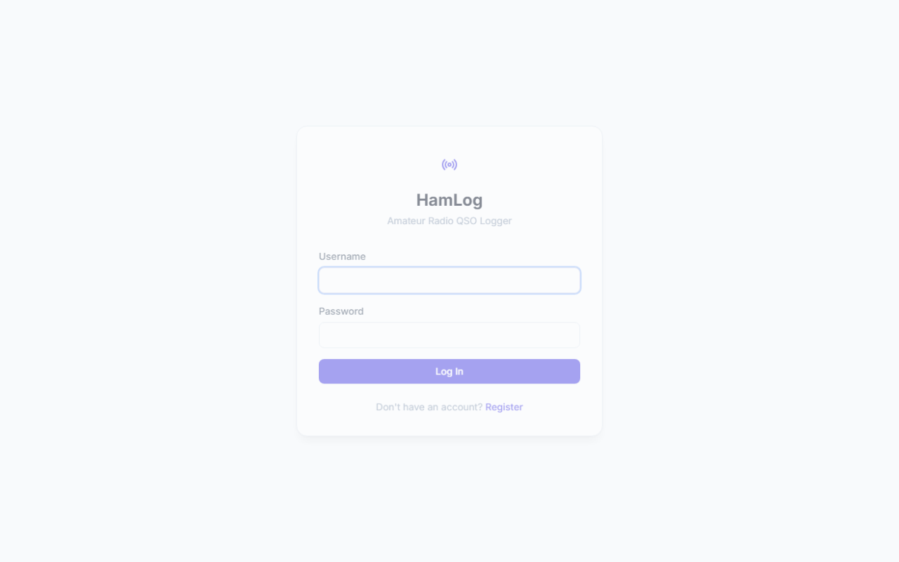

### Create your account

Click **Register** on the login screen. You will need:

- **Username** — 3 to 50 characters. Used to log in.
- **Callsign** — 3 to 12 characters (e.g. `AE9S`). Attached to your log.
  Entered in uppercase automatically.
- **Password** — at least 6 characters.
- **Confirm password** — must match.

Click **Register**. You are logged in immediately and taken to your QSO log.

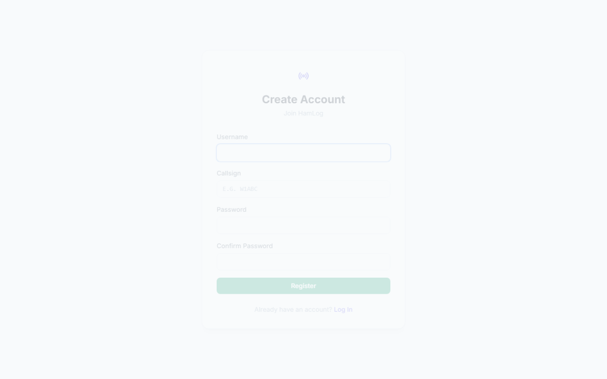

### Log in

Enter your username and password and click **Log In**. Your session lasts 24
hours; after that you will be returned to the login screen.

---

## 2. The QSO Log

After logging in, the main page shows your QSO log as a table.


Each row is one QSO. The columns are:

| Column | What it shows |
|---|---|
| (chevron) | Expand button — click to see POTA records, reports, and notes |
| Date | The date of the contact, displayed in your local format |
| Time | UTC time of the contact (HH:MM) |
| Callsign | The other station's callsign |
| Frequency | Operating frequency in MHz |
| Mode | Operating mode (SSB, CW, FT8, etc.) |
| Band | Amateur band (20m, 40m, etc.) |
| (trash) | Delete button |

The log refreshes automatically every 60 seconds. No manual reload needed.

### Mobile layout

On small screens the table is replaced by a card layout — one card per QSO,
showing the callsign, date/time, frequency, mode, and band as badges. Tap
**Details** to expand a card.

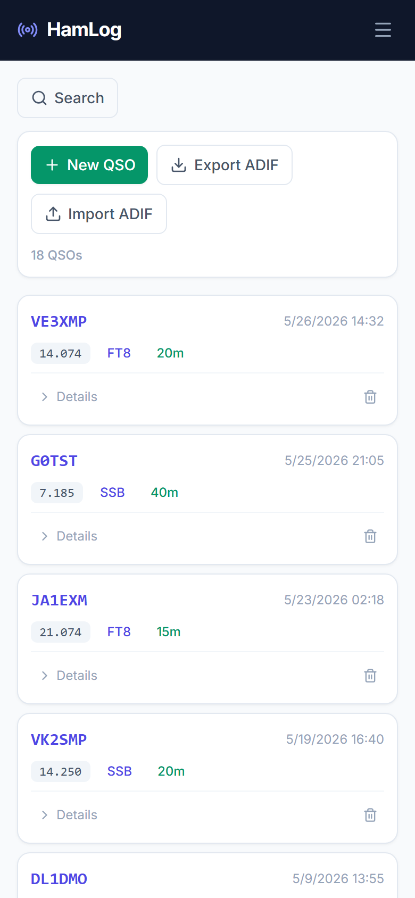

---

## 3. Logging a QSO

Click **New QSO** (the button with a + icon) in the toolbar above the log.

A modal form appears.

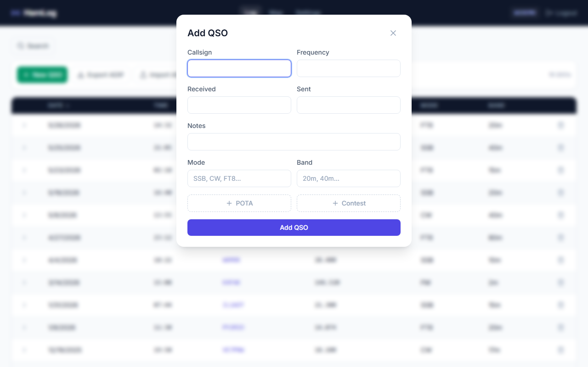

Fill in the fields:

| Field | Required | Notes |
|---|---|---|
| Callsign | Yes | The other station's callsign. Uppercased automatically. |
| Frequency | Yes | In MHz, e.g. `14.074` or `7.225`. |
| Received | No | Signal report you received, e.g. `59` or `599`. |
| Sent | No | Signal report you sent. |
| Notes | No | Free text — anything you want to remember. |
| Mode | No | e.g. `SSB`, `CW`, `FT8`. |
| Band | No | e.g. `20m`, `40m`. |

The date and time are recorded automatically at the moment you submit the form.

Click **Add QSO** to save.

### Bulk entry — multiple callsigns at once

To log contacts with several stations in one go, enter multiple callsigns in
the **Callsign** field separated by commas:

```
W1ABC, K2DEF, N3GHI
```

HamLog creates one QSO record for each callsign, all with the same frequency,
mode, band, and reports you entered.

---

## 4. POTA Logging

POTA (Parks on the Air) is a program where operators activate or make contact
with stations operating from parks and natural areas. If you are participating
in POTA, you can attach a park record to a QSO.

Inside the Add QSO form, click the **+ POTA** button. A POTA section appears:

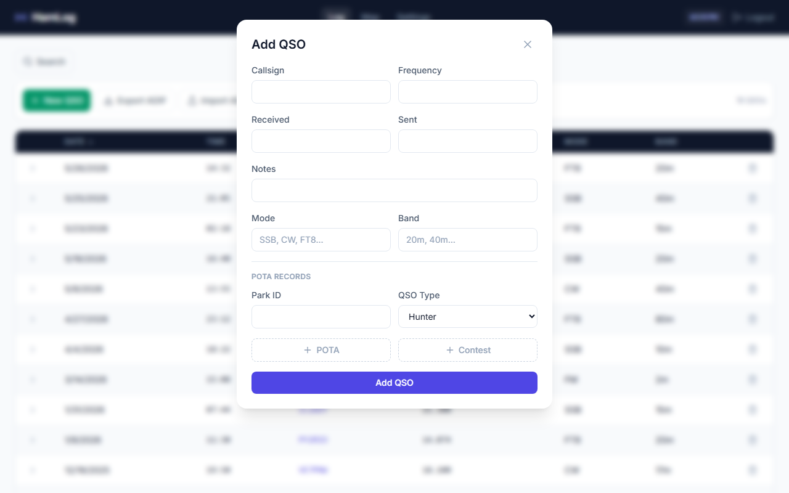

| Field | What to enter |
|---|---|
| Park ID | The POTA park designator, e.g. `K-1234` or `US-0001`. Uppercased automatically. |
| QSO Type | **Hunter** — you contacted an activator at a park. **Activator** — you were operating from the park. |

You can add multiple POTA records to a single QSO if the contact involves more
than one park.

---

## 5. Contest Logging

To log contest exchange data alongside a QSO, click the **+ Contest** button
inside the Add QSO form. You can add one contest record per QSO.

| Field | What to enter |
|---|---|
| Contest ID | A name or identifier for the contest, e.g. `CQWW-SSB` or `ARRL-FD`. |
| QSO No | Your sequential QSO number in the contest. |
| Exchange | The exchange data you received, e.g. your section or serial number. |

---

## 6. Viewing QSO Details

The main table shows the most common fields. To see POTA records, signal
reports, and notes for a QSO, click the **chevron** icon on the left side of
the row (on desktop) or tap **Details** (on mobile).

The row expands inline.

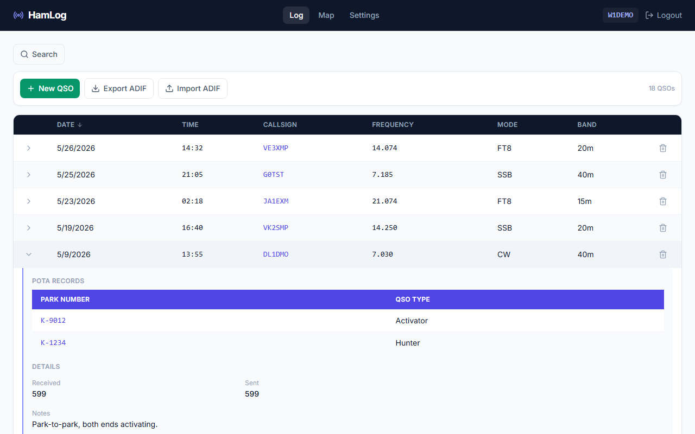

The expanded section shows:

- **POTA Records** — park ID and whether you were Hunter or Activator. Click
  a park ID to see all your QSOs with that park.
- **Details** — Received report, Sent report, and Notes (if any were entered).

Click the chevron again to collapse the row.

---

## 7. Callsign Info

HamLog looks up operator data from [HamDB](https://www.hamdb.org) the first
time you log a contact with a callsign. This happens in the background while
you work.

To see the data:

- **Desktop:** Hover your mouse over a callsign in the log.
- **Mobile:** Tap the callsign.

A panel slides in from the right showing:

- Operator name
- City, state, and country
- QSO history — a list of all contacts you have made with that callsign

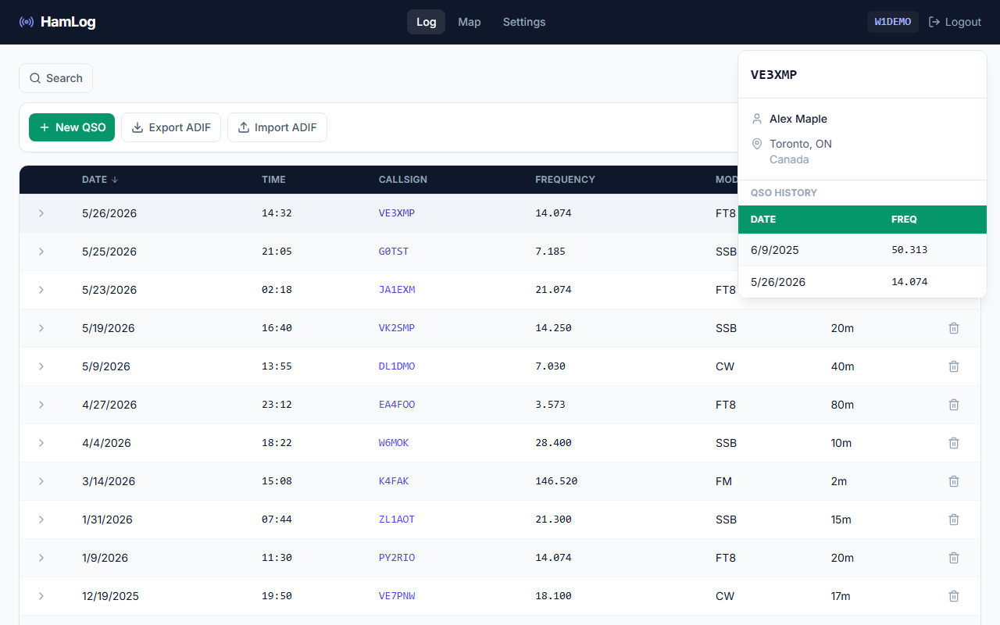

The panel appears automatically when info is available. If the panel does not
appear, HamDB may not have data for that callsign, or the lookup may still be
pending (run Backfill Locations in Settings to catch any that were missed).

---

## 8. Searching Your Log

Click the **Search** button above the table to open the filter panel.

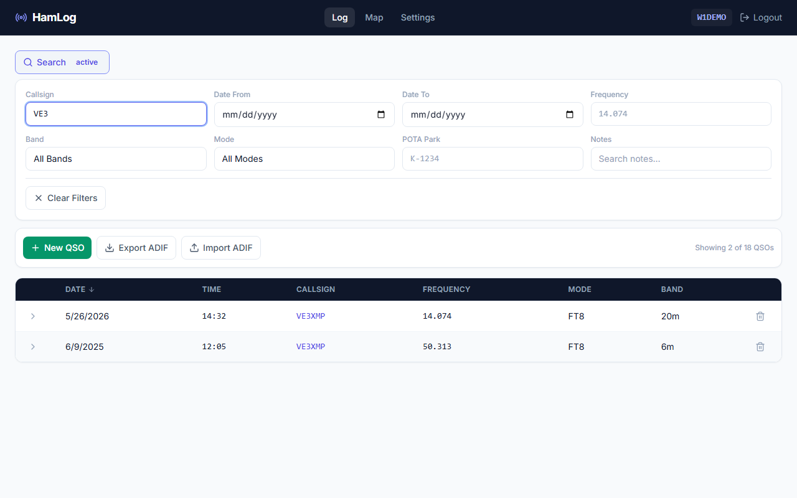

You can filter by:

| Filter | What it does |
|---|---|
| Callsign | Matches callsigns that contain the text you type (case-insensitive). |
| Date From | Shows only QSOs on or after this date. |
| Date To | Shows only QSOs on or before this date. |
| Frequency | Matches frequencies that contain the text (e.g. `14` shows all 14 MHz QSOs). |
| Band | Drop-down — select a specific band or leave blank for all. |
| Mode | Drop-down — select a specific mode or leave blank for all. |
| POTA Park | Matches park IDs that contain the text. |
| Notes | Matches notes that contain the text (case-insensitive). |

All filters combine with AND logic — a QSO must match every active filter to
appear in the results.

The toolbar shows a count while any filter is active:

```
Showing 12 of 347 QSOs
```

To remove all filters at once, click **Clear Filters** at the bottom of the
search panel. When no filters are active, the count shows the total:

```
347 QSOs
```

The Search button shows an **active** badge when any filter is set, so you can
tell at a glance whether the list is filtered.

---

## 9. Sorting

Click any underlined column header to sort the log by that column:

- **Date** — sorts by date and time (newest first by default)
- **Callsign** — sorts alphabetically
- **Frequency** — sorts numerically
- **Mode** — sorts alphabetically
- **Band** — sorts alphabetically

Click the same header again to reverse the sort direction. An arrow icon next
to the header label shows the current direction.

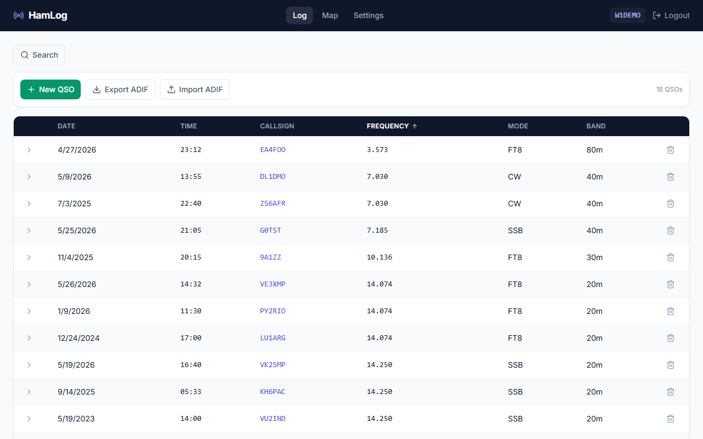

Sorting and filtering work together — the log always shows the filtered set,
sorted by your chosen column.

---

## 10. The QSO Map

Navigate to **Map** in the navigation bar to see your QSOs plotted on a world
map.


Each marker represents a QSO. The map automatically fits the view to show all
your markers at once. When you change the time filter, the view re-fits to the
new set of markers.

### Time filters

The bar above the map has preset time filters:

| Preset | Shows QSOs from |
|---|---|
| Day | Last 24 hours |
| Week | Last 7 days |
| Month | Last 30 days |
| 6 Months | Last 6 months |
| Year | Last 365 days |
| All | All time |
| Custom | Date range you choose |

Select **Custom** to enter a From and To date manually.

### Marker popups

Click any marker to see a popup with:

- Callsign
- Operator name (if available)
- City and country
- Date and time of the contact
- Frequency, mode, and band

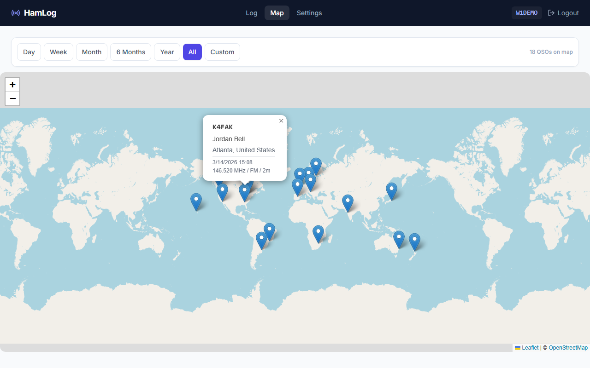

### Before the map shows markers

The map only shows QSOs where HamLog has a latitude and longitude for the
callsign. If you have a log but the map is empty, run **Backfill Locations**
in Settings first (see [Settings](#12-settings)). This queries HamDB for
location data for all callsigns in your log.

### Offline use

Map tile images are loaded from OpenStreetMap and require an internet
connection. If you are offline, the map tiles will not load (the background
shows a plain neutral color) and a banner appears:

> Map tiles unavailable offline. Markers are still shown with correct positions.

Your markers still appear in the right places even without tiles.

---

## 11. Importing and Exporting

ADIF (Amateur Data Interchange Format) is the standard file format used by
logging software. Most loggers can import and export `.adi` or `.adif` files,
making it easy to move data between programs.

### Import ADIF

1. In the QSO log toolbar, click **Import ADIF**.
2. Select a `.adi` or `.adif` file from your computer.
3. HamLog processes the file and adds the QSOs to your log.
4. A message shows how many QSOs were imported.

Existing QSOs are not affected. Imported QSOs are added alongside them.

POTA park records in the ADIF file (`APP_POTA_ID` field) are imported and
linked to the correct QSOs.

### Export ADIF

Click **Export ADIF** in the toolbar. Your browser downloads a file named
`hamlog-export.adi` containing all QSOs in your log. This file can be
imported into any ADIF-compatible logging software.

---

## 12. Settings

Navigate to **Settings** in the navigation bar.

### Appearance

Three themes are available. Click one to apply it immediately — no save button
needed.

| Theme | Description |
|---|---|
| Indigo + Emerald | Professional dashboard look |
| Teal + Amber | Warm radio aesthetic |
| Dark Mode | Easy on the eyes at night |


### Backfill Locations

HamDB looks up operator info automatically when you log a new QSO. For older
QSOs already in your log, or for any callsigns where the lookup failed, click
**Backfill Locations** to run a lookup on every callsign that is missing
location data.

The button shows progress while running and reports how many callsigns were
updated and how many failed when done.

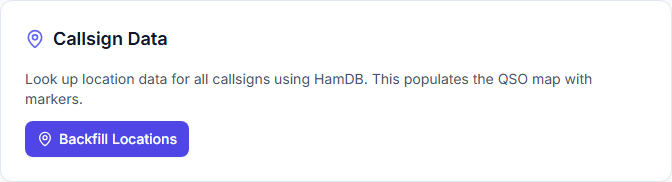

This requires an internet connection. Backfill processes one callsign every
500 ms to avoid overwhelming HamDB.

### Backup / Export

Two backup formats are available:

**Download JSON Backup** — a complete backup of all QSOs, POTA records, and
contest records in a structured JSON file. Best choice for archival and for
restoring your log.

**Download ADIF Export** — your log in standard ADIF format, compatible with
other logging software.

Both files are named with today's date, e.g. `hamlog-backup-2026-05-27.json`.

### API Access

You can automate backups using HamLog's API. The Settings page shows the exact
`curl` commands to use. The general pattern is:

1. POST to `/api/auth/login` with your username and password to get a token.
2. Use that token as a Bearer header to download a JSON or ADIF backup.

A PowerShell script is included for Windows users:

```
scripts\backup-api.ps1 -Username myuser -Password mypass
scripts\backup-api.ps1 -Format adif -Username myuser -Password mypass
```

Output goes to the `backups\` directory by default.

---

## 13. Multi-User Support

Any person on your local network can create an account. Each account has its
own callsign and its own private QSO log — one user cannot see another user's
QSOs.

There is no administrator account. Registration is open to anyone who can
reach HamLog on your network. If you want to restrict access, control it at
the network level (firewall, VLAN, etc.) rather than within HamLog.

---

## 14. Offline Use

All core features work without an internet connection:

- Logging QSOs
- Searching and sorting
- ADIF import and export
- Backup downloads

Two features require internet access:

- **Map tiles** — the map background is loaded from OpenStreetMap. Markers
  still show in the correct positions when offline.
- **HamDB callsign lookups** — operator name and location data come from
  HamDB. QSOs still save normally; the callsign info panel will simply be
  empty until a lookup succeeds.

---

## 15. Deleting QSOs

To delete a QSO, click the **trash icon** on the right side of the row. A
confirmation dialog appears asking you to confirm.

Click **Yes** to permanently delete the QSO and any associated POTA or contest
records.

**This cannot be undone.** Before deleting anything significant, download a
backup from Settings first.
